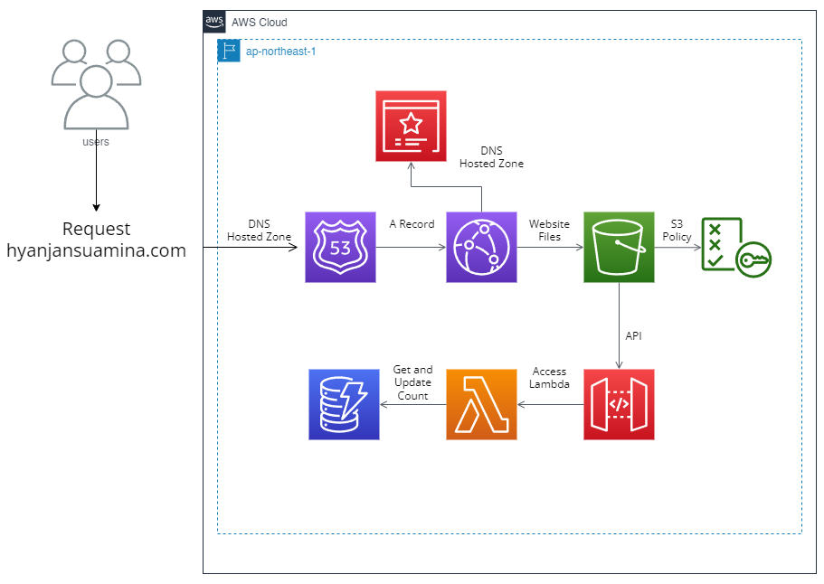

# AWS Hosted Resume - Frontend

This project is part of the Cloud Resume Challenge dedicated to test knowledge about the implementation of a static website on AWS.

## Architecture

The website uses CloudFront and S3 to host the website. Route53 was also used to redirect requests to the domain with Hosted Zones containing A Records for CloudFront distributions. The CloudFront distributions have origin directed to S3 endpoints containing the website files. These have specific S3 policies only allowing CloudFront access. CloudFront also utilizes public certificates to ensure only https is used. Lastly, the website accesses an API triggering a Lambda function to get current visitor count from the DynamoDB and updates it.

